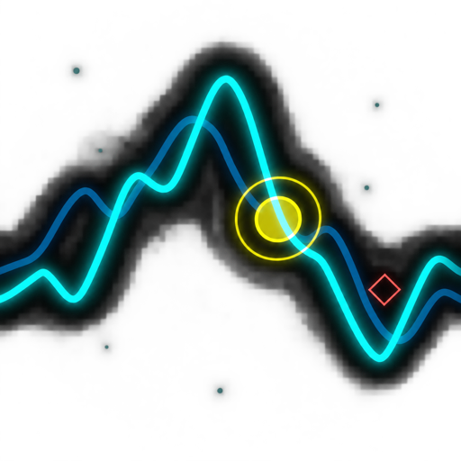

# Space Debris

[](https://github.com/koniho/spacedebris-pc/actions/workflows/build.yml)

Space Debris is a full-screen arcade typing game built with Python, PyQt5, and
PyQtGraph. Destroy incoming enemies by typing their displayed sequences, survive
escalating waves, and fight a series of animated bosses.



## Play

Download the latest build from the repository's
[Releases](https://github.com/koniho/spacedebris-pc/releases) page when a release is
available. Builds are produced for:

- Windows x64
- macOS Apple Silicon (ARM64)
- macOS Intel (x64)
- Linux x64

The macOS packages are signed with a Developer ID certificate and notarized by
Apple for tagged releases.

## Controls

Space Debris uses the home-row keys `S`, `D`, `F`, `J`, `K`, and `L`.

| Input | Action |
| --- | --- |
| `F` / `J` | Change difficulty on the title screen |
| `F` + `J` | Press together to start or restart |
| `S` `D` `F` `J` `K` `L` | Type enemy sequences |
| `P` | Pause or resume |
| `M` | Mute or unmute |
| `Shift` + `Q` | Quit |

Some enemies require repeated, reversed, shield-breaking, or simultaneous input.

## Run from source

Python 3.12 is used by the release workflow.

```bash
python3 -m venv .venv
source .venv/bin/activate
python -m pip install --upgrade pip
python -m pip install -r requirements.txt
python main.py
```

On Windows, activate the environment with `.venv\Scripts\activate` instead.

Useful command-line options:

```text
--debug          Enable diagnostic logging, the FPS display, and developer tools
--seed NUMBER    Use a deterministic random seed
--replay FILE    Replay key presses from a JSON file
--no-antialias   Disable graphics antialiasing
```

When `--debug` is active, press the backtick key (`` ` ``) to open the developer
configuration window.

## Build a distributable

Install the runtime and packaging dependencies, compile the Qt resources, and run
the spec file for the current platform:

```bash
python -m pip install -r requirements-build.txt
python -m PyQt5.pyrcc_main resources.qrc -o resources_rc.py
```

macOS:

```bash
python -m PyInstaller --noconfirm --clean space-debris-macos.spec
```

Windows:

```powershell
python -m PyInstaller --noconfirm --clean space-debris-windows.spec
```

Linux:

```bash
python -m PyInstaller --noconfirm --clean space-debris-linux.spec
```

PyInstaller builds must be created on their target operating system. GitHub
Actions builds and smoke-tests all four release variants. Pushing a tag beginning
with `v` also signs, notarizes, and staples both macOS packages.

## Save data

High scores and writable configuration are stored outside the installation:

| Platform | Location |
| --- | --- |
| Windows | `%APPDATA%\Space Debris` |
| macOS | `~/Library/Application Support/Space Debris` |
| Linux | `$XDG_DATA_HOME/space-debris` or `~/.local/share/space-debris` |

## Technology

- Python 3
- PyQt5
- PyQtGraph
- NumPy
- PyInstaller

The bundled Orbitron fonts are distributed under the SIL Open Font License; see
[`fonts/SIL Open Font License.txt`](fonts/SIL%20Open%20Font%20License.txt).
